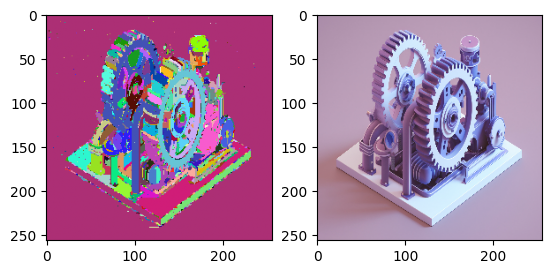
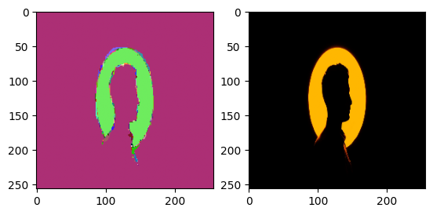
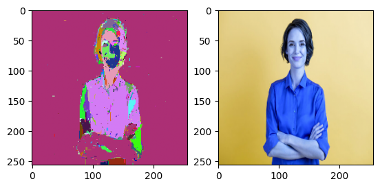

# EGBIS
A simple python package for segmentation.

# How to use?
Here is a snippet for usage:
```py
from egbis.segment import segment
import cv2

segmentation = segment(cv2.imread("example.png"), directions=[(0, 1), (1, 0)], k=100)
```

In the end you'll receive something like:







# Citations
```
Felzenszwalb, P.F., Huttenlocher, D.P. Efficient Graph-Based Image Segmentation. International Journal of Computer Vision 59, 167–181 (2004). https://doi.org/10.1023/B:VISI.0000022288.19776.77
```
